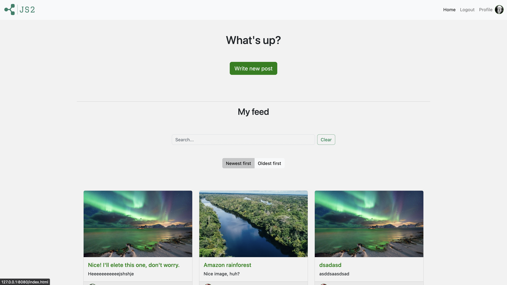

# JavaScript 2 Course Assignment

## Goal

# JavaScript 2 Course Assignment

This was my Javascript 2 Course Assignment: the task was to produce a new JavaScript front-end client for an existing social media platform.

## Goal

To apply knowledge of JavaScript techniques to implement the front-end functionality for a social media application.

- The client application must be attractive and responsive;
- Using the provided API and API documentation
- Create a functioning user interface that allows for viewing, posting, editing and deleting social media content.
- Social API routes require authorisation via JWT (JSON Web Tokens). You will need to register an account and login to access your token.

## Built with

- HTML
- Bootstrap CSS
- Javascript
- VSCode

## Links

- [Noroff API Documentation](https://noroff-api-docs.netlify.app)
- [Noroff Social API](https://nf-api.onrender.com/docs/static/index.html#/posts/get_api_v1_social_posts_)
- [Project management: Trello board](https://trello.com/invite/b/3p26zqGQ/a91b1d52a4ae8801c152e44908b64d9a/js2-some)

## Grade & Feedback from instructor

Not graded yet.

## Contributing

Feel free to suggest improvements and open a pull request if you want to get involved in this project.

## Instructions

To use the project run these commands first:

`npm install`
`npm run build`

And to use Live Server run the command:

`npm run watch`

## Contact

- [My LinkedIn page](https://www.linkedin.com/in/henri-k-78218422b/)
- [My personal portfolio](https://nehguk.github.io)
